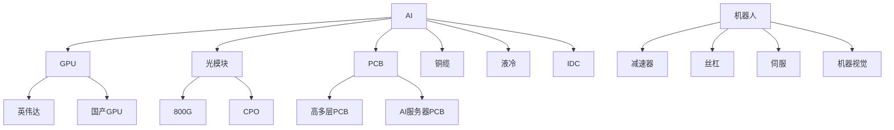
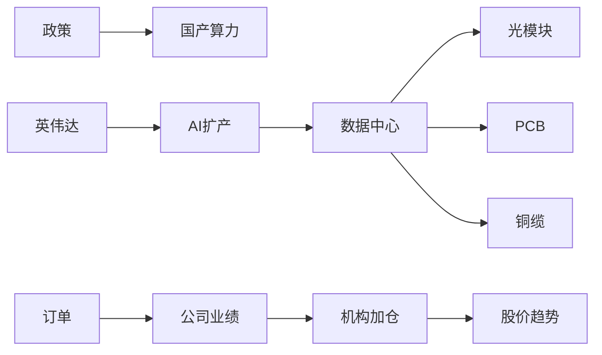

第一层：宏观级（国家/全球）

|类型|关注点|
|---|---|
|国家政策|扶持什么|
|中美关系|制裁/国产替代|
|美股科技|全球资金方向|
|利率周期|风险偏好|
|全球资本开支|科技景气|

例如：

AI为什么持续？

因为：

- 美国科技资本开支爆炸
- 英伟达带动全球AI投资
- 中国必须跟进算力
- 国家支持AI基础设施

# 第二层：产业链级（核心）

你会发现：

# 龙头涨之前，

往往先是产业链景气。

# 三、最关键：判断“增量”在哪

市场只炒：

# “新增需求”

而不是旧东西。

例如：

|方向|为什么涨|
|---|---|
|AI服务器|新需求爆炸|
|高速铜缆|AI传输升级|
|CPO|带宽需求|
|机器人|新应用周期|
|国产GPU|国产替代|

你以后分析：

不要问：

> “这个行业好不好”

而问：

# “未来1-2年需求是不是爆发？”

这是核心。

# 四、真正完整的信息链怎么建立？

这是重点。

你以后要建立：

# 产业研究树

例如AI：

你会突然理解：

# 为什么某个股涨。

不是“主力拉”。

而是：

产业需求→订单→业绩→资金。

# 五、普通人最缺的是：

# “行业锚点”

什么意思？

你必须知道：

每个方向里：

# 谁是核心风向标

例如：

|方向|锚点|
|---|---|
|AI算力|英伟达|
|国产芯片|中芯国际|
|光模块|中际旭创|
|PCB|沪电股份|
|机器人|特斯拉Optimus|
|存储|美光/三星|
|消费电子|苹果|

你每天：

不用看500条新闻。

只看：

# 锚点有没有变化。

# 六、信息来源怎么搭建（核心）

真正有效的是：

# “少而精”

很多人死于：

天天看垃圾资讯。

---

# 你应该的信息结构：

## 1）顶层（方向）

每天10分钟：

看：

- 英伟达
- 纳斯达克
- 特斯拉
- 台积电

目的：

看全球科技资金方向。

---

## 2）产业层（景气）

看：

### a）行业新闻

只看：

- 扩产
- 订单
- 涨价
- 缺货
- 新产品

因为：

# 景气度才决定行情持续性。

---

### b）纪要/电话会

重点看：

- capex（资本开支）
- 指引
- 出货量
- ASP（价格）
- 订单

例如：

英伟达说：

> 下季度继续供不应求

整个AI链继续高潮。

---

## 3）资金层（最重要）

你必须观察：

# 钱在哪

看：

- 龙虎榜
- ETF流入
- 主力净流入
- 板块成交额

因为：

# 再好的逻辑，

没资金也不涨。

---

# 七、高手怎么判断主线持续？

看四个东西：

---

## 1）业绩是否兑现

这是核心。

例如：

AI为什么持续两年？

因为：

- 真赚钱
- 真增长
- 真订单

不是PPT。

---

## 2）机构是否持续加仓

看：

- 基金重仓
- 北向资金
- 龙虎榜机构席位

---

## 3）龙头是否新高

主线最明显特点：

# 龙头不断趋势新高。

---

## 4）是否有新分支

例如：

AI：

- 最早炒模型
- 后来炒算力
- 后来炒光模块
- 后来炒铜缆
- 后来炒液冷

说明：

# 主线在扩散。

---

# 八、你最应该建立的能力

不是：

# “看新闻”

而是：

# “把新闻放进产业框架里”

例如：

看到：

> 英伟达继续扩GPU

你脑子里应该自动出现：

GPU扩产  
→ AI服务器增加  
→ PCB需求增加  
→ 铜缆需求增加  
→ 光模块需求增加  
→ 液冷需求增加

这叫：

# 产业映射能力

---

# 九、你现在最适合的方法（非常重要）

你不要同时研究10个方向。

会崩。

你应该：

# 只长期跟踪2-3个主线。

例如：

- AI算力
- 机器人
- 半导体

然后：

每天建立：

新闻  
→ 产业  
→ 订单  
→ 业绩  
→ 资金  
→ 个股

慢慢你会形成：

# “盘感”

---

# 十、真正的大局观怎么形成？

一句话：

# “长期跟踪 + 反复验证”

你会慢慢发现：

很多东西会重复。

例如：

新技术出现  
→ 美股先涨  
→ A股映射  
→ 机构吹  
→ 龙头趋势  
→ 分支扩散  
→ 全民高潮  
→ 泡沫  
→ 退潮

所有科技行情，  
几乎都这样。

政策
→ 海外
→ 产业
→ 订单
→ 业绩
→ 资金
→ 板块
→ 个股
