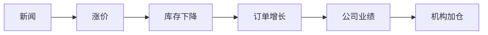

你问到了最核心的问题：

# 散户真正的壁垒不是“技术”

而是：

# 信息质量 + 信息结构化能力

因为市场最大的问题是：

```text
信息太多
≠ 有价值
```

你每天看到：

- 财联社
    
- 自媒体
    
- 小作文
    
- 群消息
    
- 券商研报
    
- 大V
    

很多互相矛盾。

最后：

# 你根本不知道谁是真的。

---

# 一、先告诉你一个残酷现实

真正顶级资金：

也不可能“完全准确”。

他们做的是：

# “高概率验证”

而不是：

# “绝对正确”

所以你不要追求：

```text
100%确定
```

而是：

```text
大概率产业趋势
```

---

# 二、市场信息分4层（非常重要）

你必须学会：

# 给信息分级。

---

# 第一层：垃圾噪音（最危险）

例如：

- 小作文
    
- 微信群
    
- 股吧
    
- 自媒体喊单
    
- “据说”
    
- “专家透露”
    

特点：

```text
情绪多
事实少
```

大部分人：

死在这里。

---

# 第二层：新闻层

例如：

- 财联社
    
- 新浪财经
    
- 华尔街见闻
    

作用：

# “知道发生了什么”

但：

不能直接交易。

因为：

# 新闻 ≠ 产业趋势。

---

# 第三层：产业数据层（核心）

真正重要的是：

# 数据。

例如：

|行业|核心数据|
|---|---|
|锂|碳酸锂价格、库存|
|AI|GPU订单、capex|
|半导体|出货量、稼动率|
|面板|面板价格|
|存储|DRAM价格|

因为：

# 数据不会骗人。

---

# 第四层：产业验证层（最核心）

这是高手和普通人的区别。

他们会看：

```text
订单
+
业绩
+
资本开支
+
扩产
```

因为：

# 真需求一定会反映到业绩。

---

# 三、你真正应该看的信息源（实战版）

我给你真正有用的。

---

# 第一类：最快的产业新闻

## 1）财联社（必备）

作用：

- 看当天资金炒什么
    
- 看政策
    
- 看突发
    

但：

# 不能全信。

只能：

```text
作为“发现方向”
```

---

## 2）华尔街见闻（非常适合你）

这是你最应该长期看的。

因为：

它会：

# 把宏观 + 产业 + 美股串起来。

你现在缺的：

正是：

# “产业逻辑串联”

---

# 第二类：真正核心（产业数据）

这里才重要。

---

# 3）生意社（非常重要）

看：

- 碳酸锂
    
- 工业品
    
- 化工
    
- 金属
    

价格趋势。

这是：

# 周期股核心。

很多游资天天盯。

---

# 4）百川盈孚 / 上海有色网（SMM）

这是：

# 产业级数据。

例如：

- 锂库存
    
- 铜库存
    
- 稀土
    
- 氦气
    
- 半导体材料
    

机构很多都看。

---

# 5）TrendForce（超级重要）

看：

- DRAM
    
- NAND
    
- 面板
    
- AI服务器
    

价格/供需。

半导体特别关键。

---

# 四、真正高手最重视的东西

不是新闻。

而是：

# “产业景气验证”

---

# 五、怎么验证真假？

这是重点。

你以后：

# 不要相信“单一消息”

而是：

# 交叉验证。

---

例如：

看到：

```text
“锂矿要涨”
```

你不能直接信。

而要验证：

---

# 第一步：价格是否真涨？

去：

- 生意社
    
- SMM
    

看：

```text
碳酸锂现货价格
```

---

# 第二步：库存是否下降？

如果：

```text
价格涨
+
库存降
```

说明：

# 真缺货。

---

# 第三步：期货是否同步？

如果：

- 现货涨
    
- 期货涨
    

说明：

# 市场预期也在加强。

---

# 第四步：上市公司是否验证？

例如：

公司说：

```text
订单增加
利润改善
```

那逻辑加强。

---

# 六、真正重要的是：

# “多源共振”

这才可信。

例如：



如果：

多个同时发生。

那：

# 产业趋势大概率是真的。

---

# 七、为什么大部分人会被骗？

因为：

# 只看故事，

不看数据。

例如：

很多概念：

```text
机器人
脑机接口
量子
```

故事很好。

但：

- 没订单
    
- 没业绩
    
- 没产业化
    

就容易：

# 一波流。

---

# 八、真正的核心：产业数据库思维

你以后必须建立：

# “行业关键指标”

例如：

---

## AI

看：

- 英伟达capex
    
- GPU供货
    
- 云厂商资本开支
    

---

## 锂

看：

- 碳酸锂价格
    
- 库存
    
- 扩产
    

---

## 半导体

看：

- DRAM价格
    
- 稼动率
    
- 去库存
    

---

## 氦气

看：

- 国际供应
    
- 高纯气价格
    
- 半导体需求
    

---

# 九、普通人最容易忽略：

# 时间差

市场不是：

```text
消息出来 → 立刻结束
```

而是：

```text
产业改善
→ 数据验证
→ 机构研究
→ 资金进场
→ 趋势形成
```

所以：

# 真主线往往持续很久。

---

# 十、给你一个真正能落地的方法（特别重要）

你不要同时研究很多行业。

你现在最适合：

# 建立：

## “3个产业观察池”

例如：

|方向|每天看什么|
|---|---|
|AI|英伟达、capex|
|锂|碳酸锂价格、库存|
|半导体|DRAM价格|

然后：

每天只花：

# 30分钟。

慢慢你会形成：

# “产业直觉”

---

# 十一、最后给你一句最重要的话

真正厉害的人：

不是：

# “消息最快”

而是：

# “最早理解：

## 哪些信息真正重要。”

因为：

市场每天99%的信息，

其实都没用。