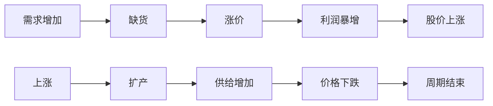

你这个问题已经进入：

# “周期与趋势交易”的核心了。

因为真正难的从来不是：

> “发现热点”

而是：

# “判断：

## 这是趋势中继，

还是顶部A杀。”

这一步，  
决定你是：

- 龙头选手  
    还是
    
- 接盘侠。
    

---

# 一、先理解：市场永远有利空

你现在最大的误区可能是：

```text
看到利空
=
行情结束
```

其实不是。

真正的大主线：

# 在上涨途中一定伴随大量利空。

例如：

|主线|当时的利空|
|---|---|
|AI|泡沫太大、估值过高|
|新能源|锂矿产能过剩|
|白酒|年轻人不喝酒|
|半导体|周期下行|
|机器人|商业化太远|

但：

# 真正决定行情的，

不是“有没有利空”

而是：

# “利空能不能改变产业趋势”

---

# 二、你举的“钠电池替代锂电”

这是非常典型的：

# “产业替代预期”

你必须学会：

# 判断：

## 替代是真产业革命

还是情绪故事。

---

# 三、怎么判断“替代威胁”真假？

看三个核心。

---

# 1）商业化程度（最重要）

很多技术：

实验室很牛。

但：

# 根本无法大规模商业化。

例如：

|技术|问题|
|---|---|
|钠电池|能量密度低|
|固态电池|成本高|
|氢能源|基础设施差|

所以：

# 不能只看“概念先进”

而要看：

```text
能不能量产
+
成本是否可接受
+
产业链是否成熟
```

---

# 2）替代比例

很多技术：

不是“完全替代”。

而是：

# 部分替代。

例如：

钠电池：

更可能：

- 储能
    
- 低端电动车
    

而：

高端动力电池：

仍需要锂。

所以：

# 需求未必消失。

---

# 3）时间维度

这是市场最容易忽略的。

例如：

```text
未来5年可能替代
```

对短线/中线资金：

# 没意义。

因为：

资金只看：

```text
未来1-2年业绩
```

---

# 四、真正决定“持续性”的是什么？

核心就一句：

# “供需缺口是否持续”

周期股本质：

就是：



所以：

# 你必须盯：

## “供需拐点”

而不是新闻。

---

# 五、怎么判断是“调整”还是“A杀”？

这是交易核心。

我给你真正实战版。

---

# 第一类：趋势调整（还能涨）

特征：

|特征|表现|
|---|---|
|龙头没死|龙头横盘/新高|
|产业逻辑没变|订单还在|
|业绩没崩|继续增长|
|资金轮动|高低切|
|板块反复活跃|有修复|

例如：

AI过去两年：

无数次暴跌。

但：

- 英伟达业绩持续爆炸
    
- capex持续增长
    
- 龙头不断新高
    

所以：

# 每次大跌都是中继。

---

# 第二类：A杀（真正结束）

真正A杀：

一般满足：

---

## 1）产业逻辑被证伪

例如：

```text
需求不及预期
库存爆炸
价格崩盘
```

这很致命。

---

## 2）业绩开始崩

真正主线：

# 一定会兑现业绩。

如果：

```text
营收下降
利润暴跌
订单缩水
```

那危险了。

---

## 3）龙头率先崩

这是最重要信号。

例如：

如果：

- 行业龙头连续趋势破位
    
- 放量大跌
    
- 无反抽
    

说明：

# 大资金开始撤退。

---

## 4）机构开始集体下修

看：

- 下调盈利预测
    
- 下调目标价
    
- 资本开支下降
    

这往往意味着：

# 景气拐点。

---

# 六、你现在最缺的：

# “产业节奏感”

很多人：

不是死在不会买。

而是：

# 不知道什么时候该撤。

---

# 七、真正高手怎么判断周期位置？

他们会看：

---

# 1）价格位置

例如：

```text
锂价是否历史高位？
```

越极端，  
越危险。

---

# 2）库存位置

周期股核心。

例如：

```text
库存持续下降
→ 景气继续

库存突然暴增
→ 周期危险
```

---

# 3）扩产速度

这最关键。

如果：

```text
所有公司都疯狂扩产
```

那通常意味着：

# 未来过剩。

---

# 4）市场预期是否过热

例如：

全民：

- 都在聊
    
- 所有人看100万亿
    
- 研报满天飞
    

往往：

# 接近中后期。

---

# 八、真正的“产业持续性”怎么研究？

你以后研究：

一定要建立：

# 三张表

---

# ① 需求表

看：

- 出货量
    
- 新增需求
    
- 增速
    

例如：

AI服务器增长多少。

---

# ② 供给表

看：

- 扩产
    
- 新产能
    
- 投产时间
    

---

# ③ 库存表

看：

- 是否缺货
    
- 是否累库
    

---

# 九、给你一个真正实战的理解

为什么：

# AI比锂矿更容易走长牛？

因为：

AI属于：

# “时代级需求扩张”

而很多资源品：

只是：

# “供需周期”

区别巨大。

---

AI：

```text
需求可能持续10年
```

锂：

```text
更多是：
供给周期 + 需求周期
```

所以：

- AI更容易趋势
    
- 资源更容易暴涨暴跌
    

---

# 十、最后给你一个最重要的判断公式

以后你看到一个方向：

不要先问：

> “会不会涨”

而是问：

# 四件事：

```text
1. 需求是不是持续增长？

2. 供给是不是短期无法释放？

3. 龙头业绩是不是持续兑现？

4. 市场是不是已经过热？
```

如果：

```text
需求强
+
供给紧
+
业绩强
+
市场没彻底疯狂
```

那：

# 趋势大概率还没结束。

---

最后一句：

# “A杀不是因为涨多了，

# 而是因为产业逻辑开始崩了。”