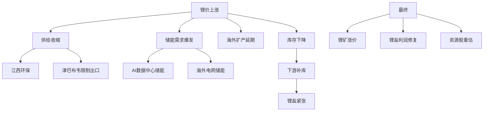
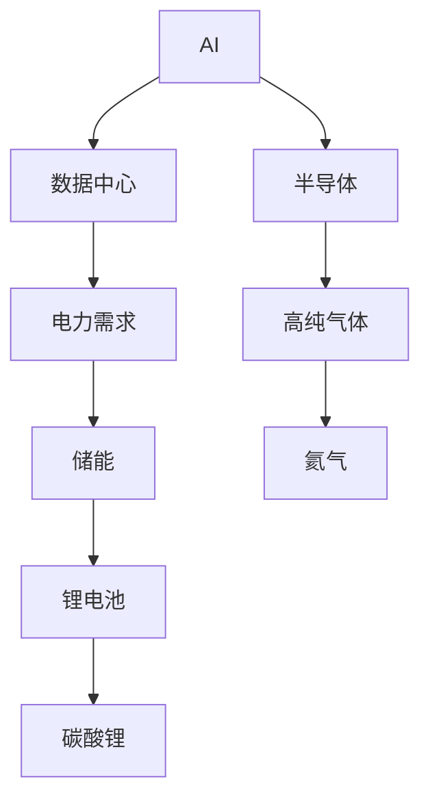

# 没有一个软件能直接告诉你：

## “这个方向还能涨多久”

真正厉害的是：

# “信息整合能力”

而不是单个软件。

---

但你现在已经进入正确阶段了：

你开始意识到：

```text
价格上涨
≠ 真正逻辑

而是：

价格上涨
→ 为什么涨
→ 谁推动
→ 能持续多久
→ 是否产业趋势
```

这已经是：

# 产业周期研究了。

---

# 一、你举的锂矿例子，非常典型

你以前可能只是看到：

```text
碳酸锂涨价
→ 锂矿股涨
```

但真正高手会拆：



这才是：

# 完整产业逻辑链。

---

# 二、这轮锂矿上涨到底为什么？

最近市场核心逻辑：

# 1）供给端出问题

例如：

- 海外矿山扩产延期
    
- 江西环保限制
    
- 津巴布韦出口限制
    

导致：

# 市场开始担心“资源不够”

([新浪网](https://k.sina.com.cn/article_7857201856_1d45362c001904fpvi.html?utm_source=chatgpt.com "锂价狂飙的原因在哪?|碳酸锂期货|磷酸铁锂|产业链|锂电|基金_新浪新闻"))

---

# 2）储能需求超预期（核心）

以前大家觉得：

```text
锂 = 新能源车
```

现在变成：

```text
锂 = 新能源车 + AI储能 + 电网储能
```

而储能正在爆发。

很多机构开始发现：

# AI数据中心非常耗电。

于是：

- 储能
    
- 电网
    
- 电池
    

需求都被拉动。

([新浪财经](https://finance.sina.com.cn/roll/2026-03-23/doc-inhrysxs2383386.shtml?utm_source=chatgpt.com "全球锂矿供给行业深度分析|碳酸锂_新浪财经_新浪网"))

---

# 3）库存低位

这是周期股特别重要的东西。

市场会看：

- 社会库存
    
- 库存天数
    
- 现货库存
    

如果：

```text
库存低
+
需求增长
+
供给跟不上
```

就容易：

# 涨价周期。

([远瞻慧库](https://www.baogaobox.com/insights/260305000026024.html?utm_source=chatgpt.com "2026年碳酸锂行业供需格局和产业链竞争态势分析 - 远瞻慧库"))

---

# 三、“能持续多久”怎么判断？

这才是真正核心。

不是看新闻。

而是看：

# 三个维度

---

# 1）涨价是“情绪”还是“缺货”

这是本质区别。

例如：

|类型|持续性|
|---|---|
|情绪炒作|很短|
|真缺货|很长|

如果：

- 真缺资源
    
- 真库存下降
    
- 真订单增加
    

持续性就会很强。

---

# 2）产业资本开支有没有跟上

周期股核心：

# “供给多久能恢复”

例如锂矿：

如果：

```text
锂价上涨
→ 大家疯狂扩产
→ 1-2年后供给爆炸
→ 周期结束
```

那么：

# 你就知道它不是永恒上涨。

---

# 3）需求是不是结构性长期增长

例如：

|行业|需求性质|
|---|---|
|AI算力|长周期|
|储能|长周期|
|猪周期|短周期|
|面板|中周期|

你必须分清：

# “时代趋势”

还是

# “短期供需”

---

# 四、氦气为什么最近涨？

这个就更典型了。

很多人会觉得：

```text
氦气？
很冷门。
```

但实际上：

# 氦气是半导体关键材料。

例如：

- 芯片制造
    
- 光纤
    
- MRI
    
- 航天
    
- 超低温设备
    

都需要。

---

最近上涨核心原因：

# 全球供应链出问题

尤其：

- 卡塔尔供应扰动
    
- 地缘冲突
    
- 高纯氦气紧张
    

导致：

# 半导体级氦气暴涨。

([新浪网](https://k.sina.com.cn/article_7095179294_1a6e7d81e06802ierc.html?utm_source=chatgpt.com "氦气价格飙升冲击半导体医疗行业|半导体相关基金|COMEX黄金|黄金连续AU0|伦敦金期货|黄金_新浪新闻"))

---

# 五、你现在最缺的不是“新闻”

而是：

# “产业地图”

你需要知道：



你会突然发现：

# 很多产业是连着的。

---

# 六、真正有用的软件/信息源（重点）

这里我给你真正实战的。

---

# 第一层：看“产业趋势”

## 最重要：

### 1）华尔街见闻

非常适合你。

优点：

- 宏观
    
- 科技
    
- 周期
    
- 商品
    

都会串逻辑。

尤其：

- AI
    
- 半导体
    
- 大宗商品
    

很强。

---

### 2）财联社

适合：

# 看“当天资金炒什么”

非常快。

---

### 3）Wind（专业）

真正机构用的。

但太贵。

里面能看：

- 价格
    
- 库存
    
- 期货
    
- 产业数据
    
- 研报
    

---

# 第二层：看产业链

## 4）行业研报（核心）

你要学会：

# 看研报目录

重点：

- 供需
    
- capex
    
- 库存
    
- 出货量
    
- ASP
    

而不是看目标价。

---

# 第三层：看全球科技

## 5）X（Twitter）

很多最快信息：

- AI
    
- 半导体
    
- 英伟达
    
- 台积电
    

都在上面。

---

## 6）SeekingAlpha / Reddit

看：

# 海外资金怎么想。

特别：

- 半导体
    
- AI
    
- 能源
    

([Reddit](https://www.reddit.com/r/Go_Stock/comments/1suxzmx/%E6%9C%80%E8%BF%91%E5%B8%82%E5%9C%BA%E9%99%A4%E4%BA%86%E7%BB%A7%E7%BB%AD%E7%9B%AF%E7%9D%80_ai_%E5%92%8C%E5%8D%8A%E5%AF%BC%E4%BD%93%E4%B9%8B%E5%A4%96%E4%B8%80%E4%BA%9B%E6%96%B0%E7%9A%84%E6%96%B9%E5%90%91%E4%B9%9F%E5%BC%80%E5%A7%8B%E8%A2%AB%E8%B5%84%E9%87%91%E9%87%8D%E6%96%B0%E5%85%B3%E6%B3%A8/?utm_source=chatgpt.com "最近市场除了继续盯着 AI 和半导体之外，一些新的方向也开始被资金重新关注。"))

---

# 七、真正高手的信息流（非常关键）

他们不是：

```text
看到新闻 → 买股票
```

而是：

```text
新闻
→ 放进产业链
→ 判断是否新增量
→ 判断持续性
→ 判断资金会炒哪一环
```

例如：

看到：

```text
AI数据中心暴增
```

高手想到：

```text
电力
→ 储能
→ 锂
→ 铜
→ 液冷
→ 柴发
→ 核电
```

这才叫：

# 产业映射。

---

# 八、你现在最应该做的（特别重要）

不要同时研究20个方向。

你会崩。

你应该：

# 长期跟踪：

- AI
    
- 半导体
    
- 锂电/储能
    

这3个就够了。

然后每天：

建立：

```text
新闻
→ 产业
→ 供需
→ 库存
→ 价格
→ 资金
→ 龙头
```

慢慢你会形成：

# “产业盘感”

---

最后一句非常重要：

# “股价只是结果，

# 产业变化才是原因。”

真正顶级交易者，

脑子里看的不是K线。

而是：

# 全球产业流动。


